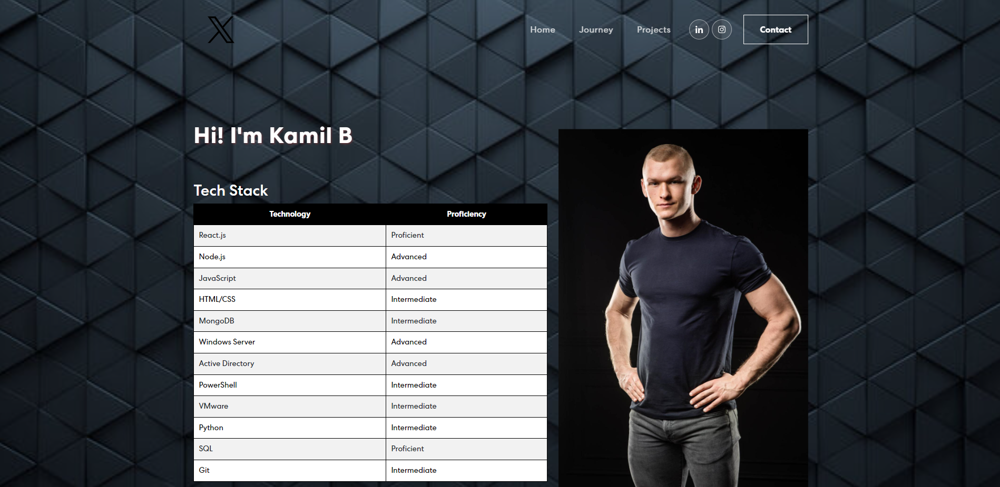
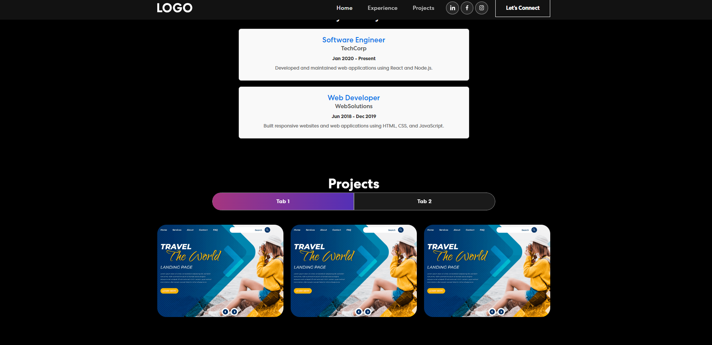
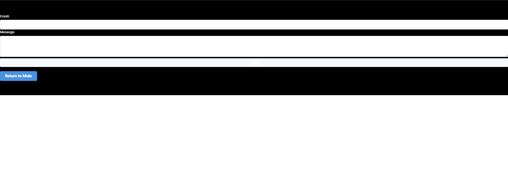

### To intsall all the required dependecies

```
npm install
```

### Start the project

```
npm start
```


### About the project

Hello!

I'd like to present my portfolio, which is a dynamic website built using React. I've utilized various modern technologies and libraries to make the site interactive and visually appealing.

The contact form is a key component of my project. It uses React Hooks for state management and integrates with EmailJS, allowing users to send emails directly from the website. This makes it easy for visitors to get in touch with me.

The banner section employs the react-on-screen library for animations of text and images as you scroll. This dynamic presentation showcases my skills and experience in an engaging manner.

In the experience section, I've employed a straightforward React structure to display my professional journey. Each experience is detailed, providing visitors with a clear understanding of my career path.

The site navigation is responsive and user-friendly, thanks to React Bootstrap. It ensures smooth transitions between different sections, enhancing the overall user experience.

The projects section showcases my work through interactive cards. I've used React Bootstrap and animate.css for animations and transitions between projects, making my portfolio visually appealing and easy to navigate.

The entire site is built using HTML, CSS, and JavaScript, allowing me precise control over its appearance and functionality.

### Screenshots









